# 📄 1. Requerimientos del Sistema – TECHCUP FÚTBOL:

# 1.1 Lista de requerimientos fucionales para usarios y jugadores:

1. Consultar perfil de usuario — El usuario autenticado puede ver su información personal registrada en el sistema como nombre, correo, programa y estado.
   
2. Actualizar información básica del usuario — El usuario puede modificar sus datos personales como nombre, relación con la Escuela y semestre, excepto correo y contraseña.
   
3. Inactivar usuario — El administrador puede desactivar un usuario siempre que no esté vinculado a un equipo en torneo activo o en progreso.
   
4. Listar y buscar usuarios — El administrador puede consultar y filtrar usuarios por nombre, correo, relación con la Escuela o estado de forma paginada.
   
5. Crear perfil deportivo — El jugador puede registrar su perfil deportivo indicando posición, número dorsal y foto.
   
6. Consultar perfil deportivo — Jugadores, capitanes y organizadores pueden ver el perfil deportivo completo de un jugador incluyendo su foto y estado de vinculación.
   
7. Actualizar perfil deportivo — El jugador puede modificar su posición, dorsal o foto siempre que no esté vinculado a un equipo en torneo activo.
   
8. Bloquear eliminación de perfil deportivo — El sistema rechaza cualquier intento de eliminar un perfil deportivo para preservar la integridad histórica del torneo.
   
9.  Buscar jugadores para invitar — El capitán puede buscar jugadores registrados en el sistema visualizando únicamente su nombre y estado (disponible o no), para decidir a cuál enviarle una invitación a su equipo.
    
10. Enviar solicitud de vinculación a equipo — Un jugador puede enviar una única solicitud activa para unirse a un equipo disponible, notificando al Servicio de Equipos.
    
11. Consultar solicitudes enviadas — El jugador puede ver el estado actual e historial de sus solicitudes de vinculación a equipos.
    
12. Cancelar solicitud de vinculación — El jugador puede cancelar su solicitud activa siempre que esté en estado pendiente, quedando disponible para enviar una nueva.
    
13. Recibir invitación de un equipo — El sistema registra invitaciones enviadas por capitanes desde el Servicio de Equipos hacia jugadores disponibles.
    
14. Consultar invitaciones recibidas — El jugador puede ver todas las invitaciones que ha recibido de equipos junto con su estado actual.
    
15. Aceptar o rechazar invitación — El jugador puede responder una invitación pendiente, confirmando la vinculación al equipo o descartándola y manteniendo su disponibilidad.
    
16. Registrar log de auditoría — El sistema registra automáticamente todas las acciones relevantes sobre usuarios y jugadores con usuario, acción, timestamp y datos modificados.

# 1.2 Requisitos no funcionales: 

1. Autenticación mediante JWT — Todos los endpoints requieren token JWT válido generado por el Servicio de Identidad, retornando 401 ante tokens ausentes, malformados o expirados.
   
2. Control de acceso por rol — Cada endpoint valida que el rol del token tiene permisos para la operación solicitada, retornando 403 si el rol es insuficiente.
   
3. Comunicación segura entre servicios — Toda comunicación entre microservicios ocurre sobre HTTPS sin exponer datos sensibles en logs ni en respuestas de error.
   
4. Separación de almacenamiento PostgreSQL y MongoDB — Los datos estructurados se persisten en PostgreSQL y las fotos de perfil exclusivamente en MongoDB, referenciadas por ID.
   
5. Integridad referencial en base de datos — El esquema garantiza que no existan perfiles huérfanos, solicitudes activas duplicadas ni invitaciones duplicadas para el mismo jugador y equipo.
   
6. Arquitectura en capas obligatoria — El microservicio separa estrictamente controlador, servicio, adaptador y repositorio sin dependencias cruzadas entre capas no adyacentes.
   
7. Integración desacoplada con microservicios externos — La comunicación con el Servicio de Equipos usa WebClient o Feign Client, manejando errores y timeouts con respuesta 503 controlada.
   
8. Cobertura de código con JaCoCo — La cobertura mínima de pruebas es del 80%, con fallo automático del build si no se alcanza el umbral configurado.
   
9.  Análisis de calidad con SonarQube — El código debe pasar el Quality Gate sin bugs críticos, vulnerabilidades de seguridad ni code smells de severidad alta.
    
10. Documentación de API con Swagger/OpenAPI — Todos los endpoints están documentados con springdoc-openapi incluyendo parámetros, body, códigos de respuesta y ejemplos.
    
11. Manejo centralizado de excepciones — Un @RestControllerAdvice global captura todos los errores retornando respuestas JSON uniformes sin exponer stack traces.
    
# 2. Especificacion de Requerimientos: 

## 2.1 Consultar perfil de usuario

| Campo | Descripción |
|-------|-------------|
| **ID** | RF-01 |
| **Nombre del requerimiento** | Consultar perfil de usuario |
| **Descripción** | El sistema debe permitir que un usuario autenticado consulte su propia información personal registrada en el sistema. |
| **Precondiciones** | El usuario debe estar autenticado con un JWT válido. El usuario debe existir en el sistema. |
| **Actor** | Estudiante, Graduado, Profesor, Personal Administrativo, Familiar, Administrador |
| **Flujo principal** | 1. El actor envía una solicitud GET a /users/{id} con su JWT. 2. El sistema valida el token y verifica que el ID corresponde al usuario autenticado o que es administrador. 3. El sistema consulta la base de datos PostgreSQL. 4. El sistema retorna nombre completo, correo, relación con la Escuela, programa académico, semestre, estado, fecha de nacimiento e identificación. |
| **Diagrama de caso de uso** | 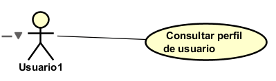 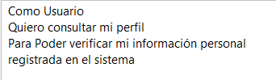|
| **Poscondiciones** | El usuario recibe su información personal. La acción queda registrada en el log de auditoría. |

---

## 2.2 Actualizar información básica del usuario

| Campo | Descripción |
|-------|-------------|
| **ID** | RF-02 |
| **Nombre del requerimiento** | Actualizar información básica del usuario |
| **Descripción** |El sistema debe permitir que un usuario autenticado o el administrador actualicen los datos personales básicos del usuario, excluyendo correo y contraseña. |
| **Precondiciones** | El usuario debe estar autenticado con un JWT válido. El usuario debe existir y estar en estado Activo. |
| **Actor** | Estudiante, Graduado, Profesor, Personal Administrativo, Familiar, Administrador. |
| **Flujo principal** | 1. El actor envía una solicitud PUT a /users/{id} con los campos a actualizar. 2. El sistema valida que el JWT corresponde al usuario o es administrador. 3. El sistema valida que no se intenta modificar correo ni contraseña. 4. El sistema valida que el semestre solo se envíe si la relación es estudiante. 5. El sistema actualiza los datos en PostgreSQL. 6. El sistema registra la acción en auditoría y retorna los datos actualizados. |
| **Diagrama de caso de uso** | 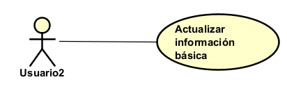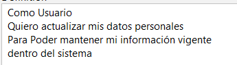 |
| **Poscondiciones** | Los datos del usuario quedan actualizados en base de datos. La acción queda registrada en el log de auditoría. |

---

## 2.3 Inactivar usuario

| Campo | Descripción |
|-------|-------------|
| **ID** | RF-03|
| **Nombre del requerimiento** | Inactivar usuario |
| **Descripción** |El sistema debe permitir al administrador cambiar el estado de un usuario a Inactivo, siempre que no esté vinculado a un equipo inscrito en un torneo Activo o En Progreso. |
| **Precondiciones** | El actor debe tener rol Administrador. El usuario a inactivar debe existir y estar en estado Activo. |
| **Actor** |  Administrador. |
| **Flujo principal** | 1. El administrador envía PATCH a /users/{id}/status con {status: "INACTIVO"}. 2. El sistema valida el rol del token. 3. El sistema consulta al Servicio de Equipos si el usuario está vinculado a un equipo en torneo Activo o En Progreso. 4. Si no hay vínculo activo, el sistema actualiza el estado del usuario a INACTIVO en PostgreSQL. 5. El sistema registra la acción en auditoría y retorna confirmación. |
| **Diagrama de caso de uso** | 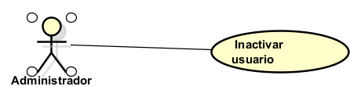 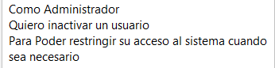 |
| **Poscondiciones** | El usuario queda con estado INACTIVO en base de datos. La acción queda registrada en auditoría. |

---

## 2.4 Listar y buscar usuarios

| Campo | Descripción |
|-------|-------------|
| **ID** | RF-04 |
| **Nombre del requerimiento** | Listar y buscar usuarios |
| **Descripción** |El sistema debe permitir al administrador consultar la lista de usuarios aplicando filtros por nombre, correo, relación con la Escuela y estado. |
| **Precondiciones** | El actor debe tener rol Administrador con JWT válido. |
| **Actor** |  Administrador. |
| **Flujo principal** | 1. El administrador envía GET a /users con parámetros opcionales: name, email, relation, status. 2. El sistema valida el rol. 3. El sistema aplica los filtros enviados en la consulta a PostgreSQL. 4. El sistema retorna la lista paginada de usuarios con sus datos básicos. |
| **Diagrama de caso de uso** | 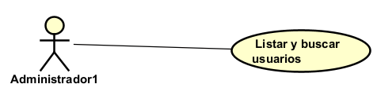 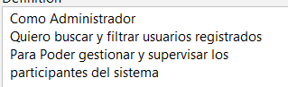 |
| **Poscondiciones** | El administrador recibe la lista de usuarios filtrada y paginada. |

---

## 2.5 Crear perfil deportivo

| Campo | Descripción |
|-------|-------------|
| **ID** | RF-05|
| **Nombre del requerimiento** | Crear perfil deportivo |
| **Descripción** |El sistema debe permitir que un usuario con rol Jugador cree su perfil deportivo indicando posición, número dorsal y foto. Cada usuario solo puede tener un perfil deportivo. |
| **Precondiciones** | El actor debe estar autenticado con JWT válido y tener rol Jugador. El usuario no debe tener un perfil deportivo previamente creado. |
| **Actor** |  Jugador |
| **Flujo principal** | 1. El jugador envía POST a /players/profile con posición, dorsal y foto. 2. El sistema valida que el token tiene rol Jugador. 3. El sistema verifica que no existe ya un perfil para ese usuario. 4. El sistema persiste los datos del perfil (posición y dorsal) en PostgreSQL. 5. El sistema almacena la foto en MongoDB. 6. El sistema retorna el perfil creado con código 201 Created. 7. La acción queda registrada en auditoría. |
| **Diagrama de caso de uso** |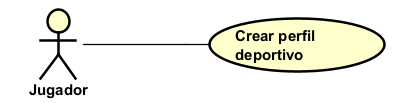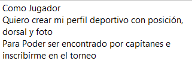 |
| **Poscondiciones** | El perfil deportivo del jugador queda registrado en PostgreSQL y la foto en MongoDB. La acción queda registrada en auditoría. |

---

## 2.6 Consultar perfil deportivo

| Campo | Descripción |
|-------|-------------|
| **ID** | RF-06|
| **Nombre del requerimiento** |Consultar perfil deportivo |
| **Descripción** |El sistema debe permitir consultar el perfil deportivo de un jugador, incluyendo su posición, dorsal y foto. |
| **Precondiciones** | El actor debe estar autenticado con JWT válido. El perfil deportivo debe existir. |
| **Actor** |  Jugador, Capitán, Organizador, Administrador.|
| **Flujo principal** | 1. El actor envía GET a /players/profile/{userId}. 2. El sistema valida el token y el rol. 3. El sistema consulta los datos del perfil en PostgreSQL. 4. El sistema recupera la foto desde MongoDB. 5. El sistema retorna el perfil completo ensamblado: posición, dorsal, foto y estado de vinculación a equipo. |
| **Diagrama de caso de uso** | 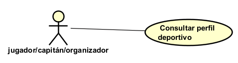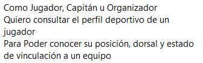 |
| **Poscondiciones** | El actor recibe la información completa del perfil deportivo del jugador. |

---

## 2.7 Actualizar perfil deportivo

| Campo | Descripción |
|-------|-------------|
| **ID** | RF-07|
| **Nombre del requerimiento** | Actualizar perfil deportivo |
| **Descripción** |El sistema debe permitir que un jugador actualice su posición, dorsal o foto, siempre que no esté vinculado a un equipo inscrito en torneo Activo o En Progreso. |
| **Precondiciones** | El actor debe estar autenticado con JWT válido y tener rol Jugador. El perfil deportivo debe existir. |
| **Actor** |  Jugador.|
| **Flujo principal** | 1. El jugador envía PUT a /players/profile con los campos a modificar. 2. El sistema valida el token y el rol. 3. El sistema consulta al Servicio de Equipos si el jugador está en un equipo con torneo Activo o En Progreso. 4. Si no hay bloqueo, el sistema actualiza los datos en PostgreSQL. 5. Si se envía nueva foto, se actualiza el documento en MongoDB. 6. El sistema retorna el perfil actualizado. 7. La acción queda registrada en auditoría. |
| **Diagrama de caso de uso** | 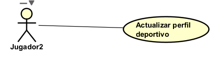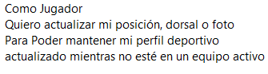 |
| **Poscondiciones** | El perfil deportivo queda actualizado en PostgreSQL y/o MongoDB. La acción queda registrada en auditoría. |

---

## 2.8 Eliminar perfil deportivo 

| Campo | Descripción |
|-------|-------------|
| **ID** | RF-08|
| **Nombre del requerimiento** | Bloquear eliminación de perfil deportivo |
| **Descripción** |El sistema no debe permitir la eliminación de perfiles deportivos bajo ninguna circunstancia para preservar la integridad histórica del torneo. |
| **Precondiciones** | N/A. |
| **Actor** |  Cualquier actor.|
| **Flujo principal** |1. El actor envía DELETE a /players/profile/{userId}. 2. El sistema retorna 405 Method Not Allowed con el mensaje: "La eliminación de perfiles deportivos no está permitida." |
| **Diagrama de caso de uso** | 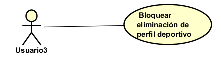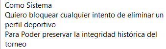 |
| **Poscondiciones** | El perfil deportivo permanece intacto en base de datos. |

---

## 2.9  Buscar jugadores para invitar

| Campo | Descripción |
|-------|-------------|
| **ID** | RF-09|
| **Nombre del requerimiento** | Buscar jugadores para invitar |
| **Descripción** |El sistema debe permitir al capitán buscar jugadores registrados en el sistema visualizando su nombre y estado de disponibilidad para decidir a cuál enviarle una invitación a su equipo. |
| **Precondiciones** | El actor debe estar autenticado con JWT válido y tener rol Capitán. |
| **Actor** |  Capitán.|
| **Flujo principal** |1. El capitán envía GET a /players?name= con el nombre del jugador a buscar. 2. El sistema valida el token y el rol. 3. El sistema consulta en PostgreSQL los jugadores que coincidan con el nombre. 4. El sistema retorna la lista de jugadores con su nombre y estado de disponibilidad. |
| **Diagrama de caso de uso** |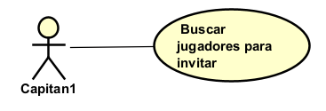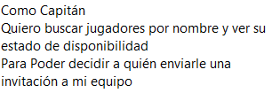 |
| **Poscondiciones** | El capitán recibe la lista de jugadores con su nombre y estado, pudiendo seleccionar a quién invitar. |

---

## 2.10  Enviar solicitud de vinculación a equipo

| Campo | Descripción |
|-------|-------------|
| **ID** | RF-010|
| **Nombre del requerimiento** | Enviar solicitud de vinculación a equipo |
| **Descripción** |El sistema debe permitir que un jugador envíe una solicitud para unirse a un equipo disponible, permitiendo solo una solicitud activa por jugador a la vez. |
| **Precondiciones** | El actor debe estar autenticado con rol Jugador. El jugador no debe estar ya vinculado a un equipo. El jugador no debe tener una solicitud en estado PENDIENTE. |
| **Actor** |  Jugador. |
| **Flujo principal** |1. El jugador envía POST a /players/requests con el ID del equipo al que desea vincularse. 2. El sistema valida el token y el rol. 3. El sistema verifica que el jugador no tenga una solicitud activa (estado PENDIENTE). 4. El sistema verifica que el jugador no esté ya en un equipo. 5. El sistema crea la solicitud con estado PENDIENTE en PostgreSQL. 6. El sistema notifica al Servicio de Equipos sobre la nueva solicitud. 7. El sistema retorna la solicitud creada con código 201. |
| **Diagrama de caso de uso** | 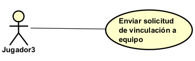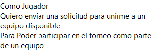|
| **Poscondiciones** | La solicitud queda registrada en estado PENDIENTE. El Servicio de Equipos es notificado. La acción queda en auditoría. |

---

## 2.11  Consultar solicitudes enviadas

| Campo | Descripción |
|-------|-------------|
| **ID** | RF-011|
| **Nombre del requerimiento** | Consultar solicitudes de vinculación |
| **Descripción** |El sistema debe permitir que un jugador consulte el estado de su solicitud de vinculación activa e historial de solicitudes anteriores. |
| **Precondiciones** | El actor debe estar autenticado con rol Jugador. |
| **Actor** |  Jugador. |
| **Flujo principal** |1. El jugador envía GET a /players/requests. 2. El sistema valida el token. 3. El sistema retorna la solicitud activa (si existe) y el historial de solicitudes anteriores con sus estados y fechas. |
| **Diagrama de caso de uso** | 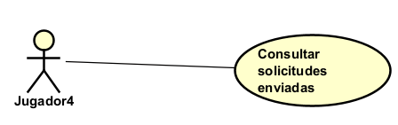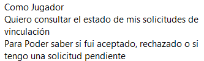 |
| **Poscondiciones** | El jugador recibe el estado actualizado de sus solicitudes. |

---

## 2.12  Cancelar solicitud de vinculación

| Campo | Descripción |
|-------|-------------|
| **ID** | RF-012|
| **Nombre del requerimiento** | Cancelar solicitud de vinculación |
| **Descripción** |El sistema debe permitir que un jugador cancele su solicitud de vinculación siempre que esta esté en estado PENDIENTE. |
| **Precondiciones** | El actor debe estar autenticado con rol Jugador. Debe existir una solicitud en estado PENDIENTE del jugador. |
| **Actor** |  Jugador. |
| **Flujo principal** |1. El jugador envía PATCH a /players/requests/{id}/cancel. 2. El sistema valida el token y que la solicitud pertenece al jugador. 3. El sistema verifica que la solicitud está en estado PENDIENTE. 4. El sistema cambia el estado a CANCELADA en PostgreSQL. 5. El sistema notifica al Servicio de Equipos de la cancelación. 6. El sistema retorna confirmación. |
| **Diagrama de caso de uso** |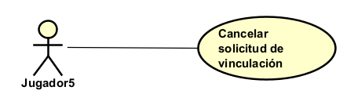 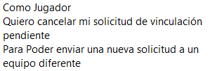|
| **Poscondiciones** |La solicitud queda en estado CANCELADA. El jugador queda disponible para enviar una nueva solicitud. La acción queda en auditoría. |

---

## 2.13   Recibir invitación de un equipo

| Campo | Descripción |
|-------|-------------|
| **ID** | RF-013|
| **Nombre del requerimiento** | Recibir invitación de equipo |
| **Descripción** |El sistema debe permitir que el Servicio de Equipos registre una invitación dirigida a un jugador, la cual quedará visible para que el jugador la gestione. |
| **Precondiciones** | El jugador invitado debe existir y estar en estado Activo. El jugador no debe estar ya vinculado a un equipo. La solicitud debe provenir del Servicio de Equipos autenticado. |
| **Actor** | Servicio de Equipos (llamada interna), Capitán (indirectamente). |
| **Flujo principal** |1. El Servicio de Equipos envía POST a /players/invitations con el ID del jugador y el ID del equipo. 2. El sistema valida la solicitud. 3. El sistema verifica que el jugador no esté ya en un equipo. 4. El sistema registra la invitación con estado PENDIENTE en PostgreSQL. 5. El sistema retorna confirmación con código 201. |
| **Diagrama de caso de uso** | 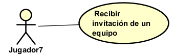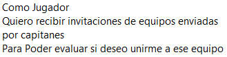 |
| **Poscondiciones** |La invitación queda registrada en estado PENDIENTE asociada al jugador.|

---

## 2.14    Consultar invitaciones recibidas

| Campo | Descripción |
|-------|-------------|
| **ID** | RF-014|
| **Nombre del requerimiento** |  Consultar invitaciones recibidas |
| **Descripción** |El sistema debe permitir que un jugador consulte todas las invitaciones que ha recibido de equipos, con sus estados actuales. |
| **Precondiciones** |El actor debe estar autenticado con rol Jugador. |
| **Actor** | Jugador.  |
| **Flujo principal** |1. El jugador envía GET a /players/invitations. 2. El sistema valida el token. 3. El sistema retorna todas las invitaciones del jugador con estado, nombre del equipo y fecha de invitación. |
| **Diagrama de caso de uso** | 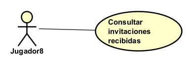 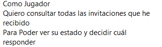|
| **Poscondiciones** | El jugador recibe la lista completa de sus invitaciones con sus estados. |

---

## 2.15  Aceptar o rechazar invitación

| Campo | Descripción |
|-------|-------------|
| **ID** | RF-015|
| **Nombre del requerimiento** |   Aceptar o rechazar invitación |
| **Descripción** |El sistema debe permitir que un jugador acepte o rechace una invitación pendiente. Al aceptar, el sistema confirma la vinculación con el Servicio de Equipos y cancela automáticamente las demás invitaciones pendientes del jugador. |
| **Precondiciones** | El actor debe estar autenticado con rol Jugador. La invitación debe existir en estado PENDIENTE y pertenecer al jugador autenticado. |
| **Actor** | Jugador.  |
| **Flujo principal** |1. El jugador envía PATCH a /players/invitations/{id} con {action: "ACCEPT"} o {action: "REJECT"}. 2. El sistema valida el token y que la invitación pertenece al jugador. 3. El sistema verifica que la invitación está en estado PENDIENTE. 4a. Si la acción es ACCEPT: el sistema cambia el estado a ACEPTADA, llama al Servicio de Equipos para confirmar la vinculación, y cambia todas las demás invitaciones pendientes del jugador a RECHAZADA. 4b. Si la acción es REJECT: el sistema cambia el estado a RECHAZADA. 5. El sistema retorna la invitación con su nuevo estado. 6. La acción queda registrada en auditoría.|
| **Diagrama de caso de uso** | 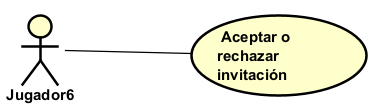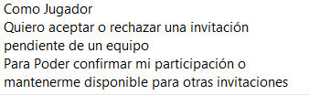 |
| **Poscondiciones** |La invitación queda en estado ACEPTADA o RECHAZADA. Si fue aceptada, el jugador queda vinculado al equipo en el Servicio de Equipos y sus demás invitaciones quedan rechazadas. La acción queda en auditoría. |

---

## 2.16 Registrar log de auditoría

| Campo | Descripción |
|-------|-------------|
| **ID** | RF-016|
| **Nombre del requerimiento** |   Registrar log de auditoría |
| **Descripción** |El sistema debe registrar automáticamente todas las acciones relevantes realizadas sobre usuarios y jugadores para garantizar trazabilidad completa. |
| **Precondiciones** |El sistema debe estar en ejecución. La acción auditada debe haberse ejecutado exitosamente.|
| **Actor** | Sistema.  |
| **Flujo principal** |1. Tras ejecutar cualquier acción relevante (actualización de usuario, inactivación, creación/actualización de perfil, envío/cancelación/aceptación/rechazo de solicitudes e invitaciones), el sistema registra automáticamente en la tabla audit_log: ID del usuario que ejecutó la acción, tipo de acción, timestamp, datos anteriores (snapshot) y datos nuevos. 2. El administrador puede consultar el log mediante GET a /audit?userId=&action=&from=&to=.|
| **Diagrama de caso de uso** | N/A (SISTEMA) |
| **Poscondiciones** |Cada acción relevante queda registrada en la tabla audit_log con todos sus metadatos. |

---
# 3. Especificacion de requiriminientos no funcionales: 

## 3.1 Seguridad: Autenticación por JWT

| Campo | Descripción |
|-------|-------------|
| **ID** | RNF-01|
| **Nombre del requerimiento** |   Autenticación mediante JWT |
| **Descripción** |Todos los endpoints del microservicio deben requerir un token JWT válido en el header Authorization: Bearer {token}. El token es generado por el Servicio de Identidad y este microservicio solo lo valida (firma y expiración). |
| **Criterio de aceptacion** |Cualquier request sin token o con token malformado/expirado retorna 401 Unauthorized. El microservicio nunca genera tokens, solo los valida.|
| **Categoría** | Seguridad  |

---

## 3.2  Seguridad: Control de acceso por rol

| Campo | Descripción |
|-------|-------------|
| **ID** | RNF-02|
| **Nombre del requerimiento** |   Control de acceso por rol. |
| **Descripción** |Cada endpoint debe validar que el rol contenido en el JWT tiene permisos para ejecutar la operación solicitada. Un jugador no puede acceder a endpoints de administrador y viceversa. |
| **Criterio de aceptacion** |Un request con token válido pero rol insuficiente retorna 403 Forbidden. La validación de rol ocurre en la capa de controlador mediante anotaciones de Spring Security (@PreAuthorize).|
| **Categoría** | Seguridad  |

---

## 3.3 Seguridad: Cifrado de datos sensibles en tránsito

| Campo | Descripción |
|-------|-------------|
| **ID** | RNF-03|
| **Nombre del requerimiento** |   Comunicación segura entre servicios |
| **Descripción** |Toda comunicación entre el microservicio Users & Players y otros microservicios (Equipos, Identidad) debe realizarse sobre HTTPS. Los datos de identificación y fecha de nacimiento del usuario no deben exponerse en logs ni en respuestas de error. |
| **Criterio de aceptacion** |Ninguna respuesta de error expone datos sensibles del usuario. Los logs del sistema no contienen números de identificación ni fechas de nacimiento en texto plano.|

---

## 3.4 Persistencia: Separación de almacenamiento por tipo de dato

| Campo | Descripción |
|-------|-------------|
| **ID** | RNF-04 |
| **Nombre del requerimiento** | Separación de almacenamiento PostgreSQL y MongoDB |
| **Descripción** |Los datos estructurados del usuario y jugador (campos de texto, números, estados, relaciones) deben persistirse en PostgreSQL. Las fotos del perfil deportivo deben almacenarse exclusivamente en MongoDB. Ningún dato estructurado debe guardarse en MongoDB ni ninguna imagen en PostgreSQL. |
| **Criterio de aceptacion** |El endpoint de creación de perfil deportivo almacena foto en MongoDB y retorna solo el ID del documento. PostgreSQL almacena ese ID como referencia. Una consulta al perfil ensambla ambas fuentes antes de retornar la respuesta.|
| **Categoría** | Persistencia |

---

## 3.5 Persistencia: Integridad referencial de datos

| Campo | Descripción |
|-------|-------------|
| **ID** | RNF-05 |
| **Nombre del requerimiento** | Integridad referencial en base de datos |
| **Descripción** | La base de datos debe garantizar que no existan perfiles deportivos huérfanos (sin usuario asociado), solicitudes duplicadas activas por jugador, ni invitaciones duplicadas activas para el mismo jugador y equipo. |
| **Criterio de aceptacion** | Las restricciones de unicidad y llaves foráneas están definidas a nivel de esquema en PostgreSQL. Las validaciones de negocio se aplican también en la capa de servicio antes de llegar a la base de datos. |
| **Categoría** | Persistencia |

---

## 3.6 Arquitectura: Separación por capas

| Campo | Descripción |
|-------|-------------|
| **ID** | RNF-06 |
| **Nombre del requerimiento** | Arquitectura en capas obligatoria |
| **Descripción** | El microservicio debe seguir estrictamente la separación en cuatro capas: controlador (recibe y valida el request HTTP), servicio/lógica (aplica reglas de negocio), adaptador (gestiona comunicación con servicios externos), repositorio/datos (acceso a PostgreSQL y MongoDB). Ninguna capa debe saltar a otra no adyacente. |
| **Criterio de aceptacion** | Un controlador nunca accede directamente a un repositorio. Un repositorio nunca contiene lógica de negocio. La revisión de código en SonarQube no reporta dependencias cruzadas entre capas. |
| **Categoría** | Arquitectura |

---

## 3.7 Arquitectura: Integración con otros microservicios mediante API REST

| Campo | Descripción |
|-------|-------------|
| **ID** | RNF-07 |
| **Nombre del requerimiento** | Integración desacoplada con microservicios externos |
| **Descripción** |La comunicación con el Servicio de Equipos debe realizarse mediante llamadas HTTP REST usando WebClient o Feign Client. El microservicio no debe compartir base de datos ni clases de dominio directamente con otros servicios. Si el Servicio de Equipos no está disponible, este microservicio debe manejar el error de forma controlada sin caer. |
| **Criterio de aceptacion** | Existe una capa adaptadora dedicada para cada servicio externo. Si el Servicio de Equipos retorna error o timeout, el microservicio retorna 503 Service Unavailable con mensaje descriptivo en lugar de lanzar una excepción no controlada. |
| **Categoría** | Arquitectura |

---

## 3.8 Calidad: Cobertura de pruebas mínima del 80%

| Campo | Descripción |
|-------|-------------|
| **ID** | RNF-08 |
| **Nombre del requerimiento** | Cobertura de código con JaCoCo |
| **Descripción** |El microservicio debe mantener una cobertura de pruebas unitarias e integración mínima del 80% medida con JaCoCo. Las pruebas deben cubrir la capa de servicio completa, los casos de éxito y los flujos alternos de error de cada requerimiento funcional. |
| **Criterio de aceptacion** | El reporte de JaCoCo muestra cobertura ≥ 80% en la capa de servicio. El build de Maven falla automáticamente si la cobertura cae por debajo del umbral configurado. Las integraciones con servicios externos se prueban con mocks (Mockito). |
| **Categoría** | Calidad |

---

## 3.9 Calidad: Calidad: Análisis estático con SonarQube

| Campo | Descripción |
|-------|-------------|
| **ID** | RNF-09 |
| **Nombre del requerimiento** | Análisis de calidad con SonarQube |
| **Descripción** |El código del microservicio debe pasar el Quality Gate de SonarQube sin bugs críticos ni bloqueantes, sin vulnerabilidades de seguridad reportadas y sin code smells de severidad alta. |
| **Criterio de aceptacion** | El Quality Gate de SonarQube retorna estado passed en cada integración. No existen vulnerabilidades de tipo BLOCKER o CRITICAL. La deuda técnica acumulada no supera 1 día de trabajo por sprint. |
| **Categoría** | Calidad |

---

## 3.10 Mantenibilidad: Documentación de API con OpenAPI

| Campo | Descripción |
|-------|-------------|
| **ID** | RNF-10 |
| **Nombre del requerimiento** | Documentación automática de endpoints con Swagger/OpenAPI |
| **Descripción** |Todos los endpoints del microservicio deben estar documentados mediante springdoc-openapi, incluyendo descripción, parámetros, body de request, posibles códigos de respuesta y ejemplos. La documentación debe estar disponible en /swagger-ui.html en el entorno de desarrollo. |
| **Criterio de aceptacion** | Cada endpoint tiene anotaciones @Operation, @ApiResponse y @Parameter completas. Un desarrollador externo puede entender y consumir el API sin necesidad de leer el código fuente. |
| **Categoría** | Mantenibilidad |

---

## 3.11 Mantenibilidad: Manejo centralizado de errores

| Campo | Descripción |
|-------|-------------|
| **ID** | RNF-11 |
| **Nombre del requerimiento** | Manejo centralizado de excepciones |
| **Descripción** |El microservicio debe tener un manejador global de excepciones (@RestControllerAdvice) que capture todos los errores y retorne respuestas HTTP con estructura uniforme: código de estado, mensaje descriptivo y timestamp. Ningún endpoint debe retornar stack traces ni mensajes de excepción de Java en texto plano. |
| **Criterio de aceptacion** | Toda excepción no controlada retorna una respuesta JSON con estructura {status, message, timestamp}. Los errores de validación de campos retornan 400 con el detalle de cada campo inválido. Nunca se expone un stack trace en la respuesta HTTP. |
| **Categoría** | Mantenibilidad |

# Diagrama de contexto
 

# Diagrama de contenedores

# Diagrama de Entidad Relacion

